# 小程序工程化实践（上篇）-- 手把手教你撸一个小程序 webpack 插件，一个例子带你熟悉 webpack 工作流程

> 本文基于 webpack 4 和 babel 7，Mac OS，VS Code

小程序开发现状：

[小程序开发者工具](https://developers.weixin.qq.com/miniprogram/dev/devtools/devtools.html)不好用，官方[对 npm 的支持有限](https://developers.weixin.qq.com/miniprogram/dev/devtools/npm.html)，缺少对 [webpack](https://webpack.docschina.org/), [babel](https://babel.docschina.org/) 等前端常用工具链的支持。

多端框架(Mpvue, Taro)崛起，但限制了原生小程序的能力。

我司在使用一段时间多端开发框架后，决定回退到原生方案，除了多端框架对原生能力有所限制外，最重要的是，我们只需要一个微信小程序，并不需要跨端。

程序虽小，但需要长期维护，多人维护，因此规范的工程化实践就很重要了。本系列文章分上下两篇，[上篇](https://github.com/listenzz/mina/blob/master/README.md)主要讲 webpack, babel, 环境配置，[下篇](https://github.com/listenzz/mina/blob/master/README.2.md)主要讲 Typescript, EsLint, 单元测试， CI / CD。

**通过本文，你将学会使用如何使用前端工程技术来开发原生小程序：**

- webpack 基础配置以及高级配置

- webpack 构建流程，这是编写 webpack 插件的基础

- 编写 webpack 插件，核心源码不到 50 行，使得小程序开发支持 npm

- 为你讲述 webpack 插件中关键代码的作用，而不仅仅是提供源码

- 优化 webpack 配置，剔除不必要的代码，减少包体积

- 支持 sass 等 css 预处理器

## 微信小程序官方对 npm 的支持程度

支持 npm 是小程序工程化的前提，[微信官方声称支持 npm](https://developers.weixin.qq.com/miniprogram/dev/devtools/npm.html)，但实际操作令人窒息。

这也是作者为什么要花大力气学习如何编写 webpack 插件，使得小程序可以像 Web 应用那样支持 npm 的缘故。不得不说，这也是一个学习编写 webpack 插件的契机。

先让我们来吐槽官方对 npm 的支持。

打开微信开发者工具 -> 项目 -> 新建项目，使用测试号创建一个小程序项目

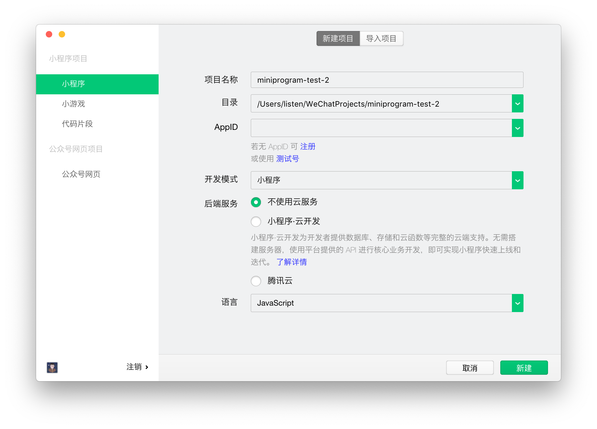

通过终端，初始化 npm

```
npm init --yes
```

可以看到，我们的项目根目录下，生成了一个 package.json 文件

现在让我们通过 npm 引入一些依赖，首先是大名鼎鼎的 moment 和 lodash

```
npm i moment lodash
```

点击微信开发者工具中的菜单栏：工具 -> 构建 npm

可以看到，在我们项目的根目录下，生成了一个叫 miniprogram_npm 的目录

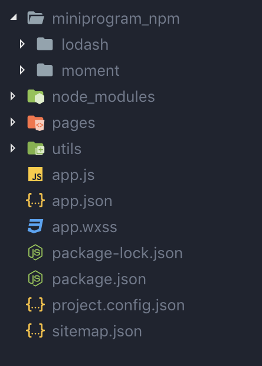

修改 app.js，添加如下内容

```diff
// app.js
+ import moment from 'moment';
App({
  onLaunch: function () {
+    console.log('-----------------------------------------------x');
+    let sFromNowText = moment(new Date().getTime() - 360000).fromNow();
+    console.log(sFromNowText);
  }
})
```

并保存，可以看到微信开发者工具控制台输出：

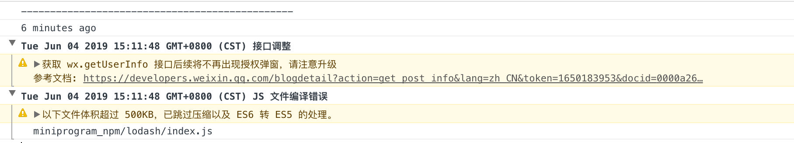

再来测试下 lodash，修改 app.js，添加如下内容

```diff
// app.js
+ import { camelCase } from 'lodash';
App({
  onLaunch: function () {
+    console.log(camelCase('OnLaunch'));
  }
})
```

保存，然后出错了


然后作者又尝试了 rxjs 这个库，也同样失败了。查阅了一些资料，说是要把 rxjs 的源码 clone 下来编译，并将编译结果复制到 miniprogram_npm 这个文件夹。尝试了下，确实可行。**但这种使用 npm 的方式也实在是太奇葩了吧**，太反人类了，不是我们熟悉的味道。

在持续查阅了一些资料和尝试后，发现使用 [webpack](https://webpack.docschina.org/) 来和 npm 搭配才是王道。

## 创建 webpack 化的小程序项目

先把 app.js 中新增的代码移除

```diff
// app.js
- import moment from 'moment';
- import { camelCase } from 'lodash';
App({
  onLaunch: function () {
-    console.log('-----------------------------------------------x');
-    let sFromNowText = moment(new Date().getTime() - 360000).fromNow();
-    console.log(sFromNowText);
-    console.log(camelCase('OnLaunch'));
  }
})
```

删掉 miniprogram_npm 这个文件夹，这真是个异类。

新建文件夹 src，把 pages, utils, app.js, app.json, app.wxss, sitemap.json 这几个文件(夹)移动进去

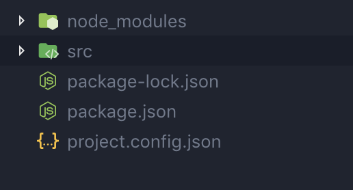

安装 webpack 和 webpack-cli

```
npm i --save-dev webpack webpack-cli copy-webpack-plugin clean-webpack-plugin
```

在根目录下，新建 webpack.config.js 文件，添加如下内容

```js
const { resolve } = require('path')
const CopyWebpackPlugin = require('copy-webpack-plugin')
const { CleanWebpackPlugin } = require('clean-webpack-plugin')

module.exports = {
  context: resolve('src'),
  entry: './app.js',
  output: {
    path: resolve('dist'),
    filename: '[name].js',
  },
  plugins: [
    new CleanWebpackPlugin({
      cleanStaleWebpackAssets: false,
    }),
    new CopyWebpackPlugin([
      {
        from: '**/*',
        to: './',
      },
    ]),
  ],
  mode: 'none',
}
```

修改 project.config.json 文件，指明小程序的入口

```diff
// project.config.json
{
"description": "项目配置文件",
+  "miniprogramRoot": "dist/",
}
```

在终端输入 npx webpack。

可以看到，在小程序开发者工具的模拟器中，我们的小程序刷新了，而且控制台也没有错误提示。

在我们项目的根目录中，生成了一个叫 dist 的文件夹，里面的内容和 src 中一模一样，除了多了个 main.js 文件。

对 webpack 有所了解的同学都知道，这是 webpack 化项目的经典结构

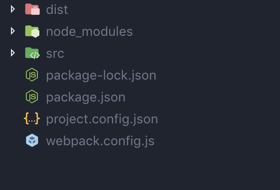

如果你对 webpack 从不了解，那么此时你应该去阅读以下文档，直到你弄明白为什么会多了个 main.js 文件。

[起步](https://webpack.docschina.org/guides/getting-started/)

[入口起点(entry points)](https://webpack.docschina.org/concepts/entry-points/)

[入口和上下文(entry and context)](https://webpack.docschina.org/configuration/entry-context/)

[输出(output)](https://webpack.docschina.org/concepts/output/)

[loader](https://webpack.docschina.org/concepts/loaders/)

[插件(plugin)](https://webpack.docschina.org/concepts/plugins/)

在上面的例子中，我们只是简单地将 src 中的文件原封不动地复制到 dist 中，并且让微信开发者工具感知到，dist 中才是我们要发布的代码。

**这是重要的一步，因为我们搭建了一个 webpack 化的小程序项目。**

我们使用 npm，主要是为了解决 js 代码的依赖问题，那么 js 交给 webpack 来处理，其它文件诸如 .json, .wxml, .wxss 直接复制就好了，这么想，事情就会简单很多。

如果你对 webpack 已有基本了解，那么此时，你应该理解小程序是个多页面应用程序，它有多个入口。

下面，让我们修改 webpack.config.js 来配置入口

```diff
-  entry: './app.js'
+  entry: {
+    'app'              : './app.js',
+    'pages/index/index': './pages/index/index.js',
+    'pages/logs/logs'  : './pages/logs/logs.js'
+  },
```

webpack 需要借助 babel 来处理 js，因此 babel 登场。

```
npm i  @babel/core @babel/preset-env babel-loader --save-dev
```

在根目录创建 .babelrc 文件，添加如下内容

```js
// .babelrc
{
  "presets": ["@babel/env"]
}
```

修改 webpack.config.js，使用 babel-loader 来处理 js 文件

```diff
module.exports = {
+  module: {
+    rules: [
+      {
+         test: /\.js$/,
+         use: 'babel-loader'
+       }
+     ]
+   },
}
```

从 src 复制文件到 dist 时，排除 js 文件

```diff
new CopyWebpackPlugin([
  {
    from: '**/*',
    to: './',
+   ignore: ['**/*.js']
  }
])
```

此时，webpack.config.js 文件看起来是这样的：

```js
const { resolve } = require('path')
const CopyWebpackPlugin = require('copy-webpack-plugin')
const { CleanWebpackPlugin } = require('clean-webpack-plugin')

module.exports = {
  context: resolve('src'),
  entry: {
    app: './app.js',
    'pages/index/index': './pages/index/index.js',
    'pages/logs/logs': './pages/logs/logs.js',
  },
  output: {
    path: resolve('dist'),
    filename: '[name].js',
  },
  module: {
    rules: [
      {
        test: /\.js$/,
        use: 'babel-loader',
      },
    ],
  },
  plugins: [
    new CleanWebpackPlugin({
      cleanStaleWebpackAssets: false,
    }),
    new CopyWebpackPlugin([
      {
        from: '**/*',
        to: './',
        ignore: ['**/*.js'],
      },
    ]),
  ],
  mode: 'none',
}
```

执行 `npx webpack`

可以看到，在 dist 文件夹中，main.js 不见了，同时消失的还有 utils 整个文件夹，因为 utils/util.js 已经被合并到依赖它的 pages/logs/logs.js 文件中去了。

> 为什么 main.js 会不见了呢？

可以看到，在小程序开发者工具的模拟器中，我们的小程序刷新了，而且控制台也没有错误提示。

把下面代码添加回 app.js 文件，看看效果如何？

```diff
// app.js
+ import moment from 'moment';
+ import { camelCase } from 'lodash';
App({
  onLaunch: function () {
+    console.log('-----------------------------------------------x');
+    let sFromNowText = moment(new Date().getTime() - 360000).fromNow();
+    console.log(sFromNowText);
+    console.log(camelCase('OnLaunch'));
  }
})
```

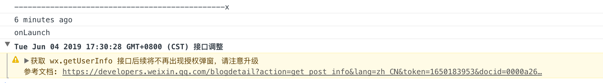

可以看到，不管是 moment 还是 lodash, 都能正常工作。

**这是重要的里程碑的一步，因为我们终于能够正常地使用 npm 了。**

而此时，我们还没有开始写 webpack 插件。

如果你有留意，在执行 `npx webpack` 命令时，终端会输出以下信息

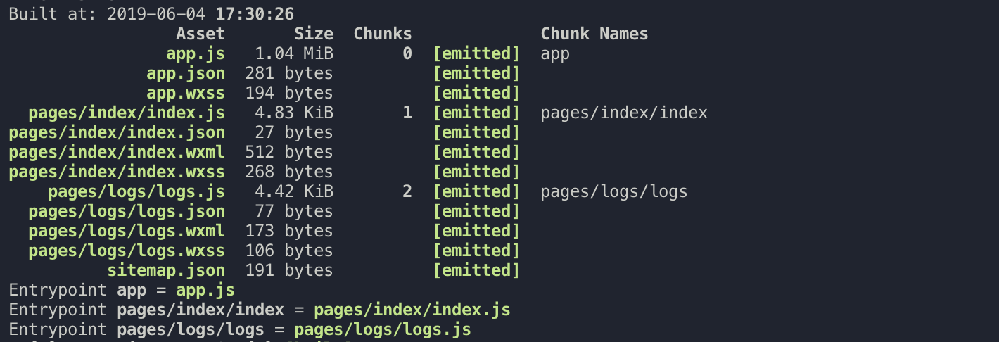

生成的 app.js 文件居然有 1M 那么大，要知道，小程序有 2M 的大小限制，这个不用担心，稍后我们通过 webpack 配置来优化它。

而现在，我们开始写 webpack 插件。

### 第一个 webpack 插件

前面，我们通过以下方式来配置小程序的入口，

```js
entry: {
  'app': './app.js',
  'pages/index/index': './pages/index/index.js',
  'pages/logs/logs': './pages/logs/logs.js',
},
```

这实在是太丑陋啦，这意味着每写一个 page 或 component，就得配置一次，我们写个 webpack 插件来处理这件事情。

首先安装一个可以替换文件扩展名的依赖

```
npm i --save-dev replace-ext
```

在项目根目录中创建一个叫 plugin 的文件夹，在里面创建一个叫 MinaWebpackPlugin.js 的文件，内容如下：

```js
// plugin/MinaWebpackPlugin.js
const SingleEntryPlugin = require('webpack/lib/SingleEntryPlugin')
const MultiEntryPlugin = require('webpack/lib/MultiEntryPlugin')
const path = require('path')
const fs = require('fs')
const replaceExt = require('replace-ext')

function itemToPlugin(context, item, name) {
  if (Array.isArray(item)) {
    return new MultiEntryPlugin(context, item, name)
  }
  return new SingleEntryPlugin(context, item, name)
}

function _inflateEntries(entries = [], dirname, entry) {
  const configFile = replaceExt(entry, '.json')
  const content = fs.readFileSync(configFile, 'utf8')
  const config = JSON.parse(content)

  ;['pages', 'usingComponents'].forEach(key => {
    const items = config[key]
    if (typeof items === 'object') {
      Object.values(items).forEach(item => inflateEntries(entries, dirname, item))
    }
  })
}

function inflateEntries(entries, dirname, entry) {
  entry = path.resolve(dirname, entry)
  if (entry != null && !entries.includes(entry)) {
    entries.push(entry)
    _inflateEntries(entries, path.dirname(entry), entry)
  }
}

class MinaWebpackPlugin {
  constructor() {
    this.entries = []
  }

  // apply 是每一个插件的入口
  apply(compiler) {
    const { context, entry } = compiler.options
    // 找到所有的入口文件，存放在 entries 里面
    inflateEntries(this.entries, context, entry)

    // 这里订阅了 compiler 的 entryOption 事件，当事件发生时，就会执行回调里的代码
    compiler.hooks.entryOption.tap('MinaWebpackPlugin', () => {
      this.entries
        // 将文件的扩展名替换成 js
        .map(item => replaceExt(item, '.js'))
        // 把绝对路径转换成相对于 context 的路径
        .map(item => path.relative(context, item))
        // 应用每一个入口文件，就像手动配置的那样
        // 'app'              : './app.js',
        // 'pages/index/index': './pages/index/index.js',
        // 'pages/logs/logs'  : './pages/logs/logs.js',
        .forEach(item => itemToPlugin(context, './' + item, replaceExt(item, '')).apply(compiler))
      // 返回 true 告诉 webpack 内置插件就不要处理入口文件了，因为这里已经处理了
      return true
    })
  }
}

module.exports = MinaWebpackPlugin
```

该插件所做的事情，和我们手动配置 entry 所做的一模一样，通过代码分析 .json 文件，找到所有可能的入口文件，添加到 webpack。

修改 webpack.config.js，应用该插件

```diff
+ const MinaWebpackPlugin = require('./plugin/MinaWebpackPlugin');

module.exports = {
   context: resolve('src'),
-  entry: {
-    'app'              : './app.js',
-    'pages/index/index': './pages/index/index.js',
-    'pages/logs/logs'  : './pages/logs/logs.js'
-  },
+  entry: './app.js',

   plugins: [
+    new MinaWebpackPlugin()
   ],
   mode: 'none'
};
```

执行 `npx webpack`，顺利通过！

上面的插件代码是否读得不太懂？因为我们还没有了解 webpack 的工作流程。

## webpack 构建流程

编程就是处理输入和输出的技术，webpack 好比一台机器，entry 就是原材料，经过若干道工序（plugin, loader），产生若干中间产物 (dependency, module, chunk, assets)，最终将产品放到 dist 文件夹中。

在讲解 webpack 工作流程之前，请先阅读[官方编写一个插件指南](https://webpack.docschina.org/contribute/writing-a-plugin/)，对一个插件的构成，事件钩子有哪些类型，如何触及(订阅)，如何调用(发布)，有一个感性的认识。

我们在讲解 webpack 流程时，对理解我们将要编写的小程序 webpack 插件有帮助的地方会详情讲解，其它地方会简略，如果希望对 webpack 流程有比较深刻的理解，还需要阅读其它资料以及源码。

### 初始化阶段

当我们执行 `npx webpack` 这样的命令时，webpack 会解析 webpack.config.js 文件，以及命令行参数，将其中的配置和参数合成一个 options 对象，然后调用 [webpack 函数](https://github.com/webpack/webpack/blob/master/lib/webpack.js#L25)

```js
// webpack.js
const webpack = (options, callback) => {
  let compiler

  // 补全默认配置
  options = new WebpackOptionsDefaulter().process(options)

  // 创建 compiler 对象
  compiler = new Compiler(options.context)
  compiler.options = options

  // 应用用户通过 webpack.config.js 配置或命令行参数传递的插件
  if (options.plugins && Array.isArray(options.plugins)) {
    for (const plugin of options.plugins) {
      plugin.apply(compiler)
    }
  }

  // 根据配置，应用 webpack 内置插件
  compiler.options = new WebpackOptionsApply().process(options, compiler)

  // compiler 启动
  compiler.run(callback)
  return compiler
}
```

在这个函数中，创建了 compiler 对象，并将完整的配置参数 options 保存到 compiler 对象中，最后调用了 compiler 的 run 方法。

compiler 对象代表了完整的 webpack 环境配置。这个对象在启动 webpack 时被一次性建立，并配置好所有可操作的设置，包括 options，loader 和 plugin。可以使用 compiler 来访问 webpack 的主环境。

从以上源码可以看到，用户配置的 plugin 先于内置的 plugin 被应用。

[WebpackOptionsApply.process](https://github.com/webpack/webpack/blob/master/lib/WebpackOptionsApply.js#L288) 注册了相当多的内置插件，其中有一个：

```js
// WebpackOptionsApply.js
class WebpackOptionsApply extends OptionsApply {
  process(options, compiler) {
    new EntryOptionPlugin().apply(compiler)
    compiler.hooks.entryOption.call(options.context, options.entry)
  }
}
```

WebpackOptionsApply 应用了 EntryOptionPlugin 插件并立即触发了 compiler 的 entryOption 事件钩子，

而 [EntryOptionPlugin](https://github.com/webpack/webpack/blob/master/lib/EntryOptionPlugin.js) 内部则注册了对 entryOption 事件钩子的监听。

[entryOption](https://github.com/webpack/webpack/blob/master/lib/Compiler.js#L98) 是个 SyncBailHook, 意味着只要有一个插件返回了 true, 注册在这个钩子上的后续插件代码，将不会被调用。我们在编写小程序插件时，用到了这个特性。

```js
// EntryOptionPlugin.js
const itemToPlugin = (context, item, name) => {
  if (Array.isArray(item)) {
    return new MultiEntryPlugin(context, item, name)
  }
  return new SingleEntryPlugin(context, item, name)
}

module.exports = class EntryOptionPlugin {
  apply(compiler) {
    compiler.hooks.entryOption.tap('EntryOptionPlugin', (context, entry) => {
      if (typeof entry === 'string' || Array.isArray(entry)) {
        // 如果没有指定入口的名字，那么默认为 main
        itemToPlugin(context, entry, 'main').apply(compiler)
      } else if (typeof entry === 'object') {
        for (const name of Object.keys(entry)) {
          itemToPlugin(context, entry[name], name).apply(compiler)
        }
      } else if (typeof entry === 'function') {
        new DynamicEntryPlugin(context, entry).apply(compiler)
      }
      // 注意这里返回了 true,
      return true
    })
  }
}
```

EntryOptionPlugin 中的代码非常简单，它主要是根据 entry 的类型，把工作委托给 `SingleEntryPlugin`, `MultiEntryPlugin` 以及 `DynamicEntryPlugin`。

这三个插件的代码也并不复杂，逻辑大致相同，最终目的都是调用 `compilation.addEntry`，让我们来看看 [SingleEntryPlugin](https://github.com/webpack/webpack/blob/master/lib/SingleEntryPlugin.js) 的源码

```js
// SingleEntryPlugin.js
class SingleEntryPlugin {
  constructor(context, entry, name) {
    this.context = context
    this.entry = entry
    this.name = name
  }

  apply(compiler) {
    // compiler 在 run 方法中调用了 compile 方法，在该方法中创建了 compilation 对象
    compiler.hooks.compilation.tap('SingleEntryPlugin', (compilation, { normalModuleFactory }) => {
      // 设置 dependency 和 module 工厂之间的映射关系
      compilation.dependencyFactories.set(SingleEntryDependency, normalModuleFactory)
    })

    // compiler 创建 compilation 对象后，触发 make 事件
    compiler.hooks.make.tapAsync('SingleEntryPlugin', (compilation, callback) => {
      const { entry, name, context } = this

      // 根据入口文件和名称创建 Dependency 对象
      const dep = SingleEntryPlugin.createDependency(entry, name)

      // 随着这个方法被调用，将会开启编译流程
      compilation.addEntry(context, dep, name, callback)
    })
  }

  static createDependency(entry, name) {
    const dep = new SingleEntryDependency(entry)
    dep.loc = { name }
    return dep
  }
}
```

那么 make 事件又是如何被触发的呢？当 WebpackOptionsApply.process 执行完后，将会调用 compiler 的 run 方法，而 run 方法又调用了 compile 方法，在里面触发了 make 事件钩子，如下面代码所示：

```js
// webpack.js
const webpack = (options, callback) => {
  // 根据配置，应用 webpack 内置插件，其中包括 EntryOptionPlugin，并触发了 compiler 的 entryOption 事件
  // EntryOptionPlugin 监听了这一事件，并应用了 SingleEntryPlugin
  // SingleEntryPlugin 监听了 compiler 的 make 事件，调用 compilation 对象的 addEntry 方法开始编译流程
  compiler.options = new WebpackOptionsApply().process(options, compiler)

  // 这个方法调用了 compile 方法，而 compile 触发了 make 这个事件，控制权转移到 compilation
  compiler.run(callback)
}
```

```js
// Compiler.js
class Compiler extends Tapable {
  run(callback) {
    const onCompiled = (err, compilation) => {
      // ...
    }
    // 调用 compile 方法
    this.compile(onCompiled)
  }

  compile(callback) {
    const params = this.newCompilationParams()
    this.hooks.compile.call(params)
    // 创建 compilation 对象
    const compilation = this.newCompilation(params)
    // 触发 make 事件钩子，控制权转移到 compilation，开始编译流程
    this.hooks.make.callAsync(compilation, err => {
      // ...
    })
  }

  newCompilation(params) {
    const compilation = this.createCompilation()
    // compilation 对象创建后，触发 compilation 事件钩子
    // 如果想要监听 compilation 中的事件，这是个好时机
    this.hooks.compilation.call(compilation, params)
    return compilation
  }
}
```

webpack 函数创建了 compiler 对象，而 compiler 对象创建了 compilation 对象。compiler 对象代表了完整的 webpack 环境配置，而 compilatoin 对象则负责整个打包过程，它存储着打包过程的中间产物。compiler 对象触发 make 事件后，控制权就会转移到 compilation，compilation 通过调用 addEntry 方法，开始了编译与构建主流程。

现在，我们有足够的知识理解之前编写的 webpack 插件了

```js
// MinaWebpackPlugin.js
class MinaWebpackPlugin {
  constructor() {
    this.entries = []
  }

  apply(compiler) {
    const { context, entry } = compiler.options
    inflateEntries(this.entries, context, entry)

    // 和 EntryOptionPlugin 一样，监听 entryOption 事件
    // 这个事件在 WebpackOptionsApply 中触发
    compiler.hooks.entryOption.tap(pluginName, () => {
      this.entries
        .map(item => replaceExt(item, '.js'))
        .map(item => path.relative(context, item))
        // 和 EntryOptionPlugin 一样，为每一个 entry 应用 SingleEntryPlugin
        .forEach(item => itemToPlugin(context, './' + item, replaceExt(item, '')).apply(compiler))

      // 和 EntryOptionPlugin 一样，返回 true。由于 entryOption 是个 SyncBailHook，
      // 而自定义的插件先于内置的插件执行，所以 EntryOptionPlugin 这个回调中的代码不会再执行。
      return true
    })
  }
}
```

> 为了动态注册入口，除了可以监听 entryOption 这个钩子外，我们还可以监听 make 这个钩子来达到同样的目的。

### module 构建阶段

`addEntry` 中调用了私有方法 `_addModuleChain` ，这个方法主要做了两件事情。一是根据模块的类型获取对应的模块工厂并创建模块，二是构建模块。

这个阶段，主要是 [loader](https://webpack.docschina.org/loaders/) 的舞台。

```js
class Compilation extends Tapable {
  // 如果有留意 SingleEntryPlugin 的源码，应该知道这里的 entry 不是字符串，而是 Dependency 对象
  addEntry(context, entry, name, callback) {
    this._addModuleChain(context, entry, onModule, callbak)
  }

  _addModuleChain(context, dependency, onModule, callback) {
    const Dep = dependency.constructor
    // 获取模块对应的工厂，这个映射关系在 SingleEntryPlugin 中有设置
    const moduleFactory = this.dependencyFactories.get(Dep)
    // 通过工厂创建模块
    moduleFactory.create(/*
      在这个方法的回调中，
      调用 this.buildModule 来构建模块。
      构建完成后，调用 this.processModuleDependencies 来处理模块的依赖
      这是一个循环和递归过程，通过依赖获得它对应的模块工厂来构建子模块，直到把所有的子模块都构建完成
    */)
  }

  buildModule(module, optional, origin, dependencies, thisCallback) {
    // 构建模块
    module.build(/*
    而构建模块作为最耗时的一步，又可细化为三步：
    1. 调用各 loader 处理模块之间的依赖
    2. 解析经 loader 处理后的源文件生成抽象语法树 AST
    3. 遍历 AST，获取 module 的依赖，结果会存放在 module 的 dependencies 属性中
    */)
  }
}
```

### chunk 生成阶段

在所有的模块构建完成后，webpack 调用 `compilation.seal` 方法，开始生成 chunks。

```js
// https://github.com/webpack/webpack/blob/master/lib/Compiler.js#L625
class Compiler extends Tapable {
  compile(callback) {
    const params = this.newCompilationParams()
    this.hooks.compile.call(params)
    // 创建 compilation 对象
    const compilation = this.newCompilation(params)
    // 触发 make 事件钩子，控制权转移到 compilation，开始编译流程
    this.hooks.make.callAsync(compilation, err => {
      // 编译和构建流程结束后，回到这里，
      compilation.seal(err => {})
    })
  }
}
```

每一个[入口起点](https://webpack.docschina.org/guides/code-splitting/#%E5%85%A5%E5%8F%A3%E8%B5%B7%E7%82%B9-entry-points-)、[公共依赖](https://webpack.docschina.org/guides/code-splitting/#%E9%98%B2%E6%AD%A2%E9%87%8D%E5%A4%8D-prevent-duplication-)、[动态导入](https://webpack.docschina.org/guides/code-splitting/#%E5%8A%A8%E6%80%81%E5%AF%BC%E5%85%A5-dynamic-imports-)、[runtime 抽离](https://webpack.docschina.org/configuration/optimization/#optimization-runtimechunk) 都会生成一个 chunk。

`seal` 方法包含了优化、分块、哈希，编译停止接收新模块，开始生成 chunks。此阶段依赖了一些 webpack 内部插件对 module 进行优化，为本次构建生成的 chunk 加入 hash 等。

```js
// https://github.com/webpack/webpack/blob/master/lib/Compilation.js#L1188
class Compilation extends Tapable {
  seal(callback) {
    // _preparedEntrypoints 在 addEntry 方法中被填充，它存放着 entry 名称和对应的 entry module
    // 将 entry 中对应的 module 都生成一个新的 chunk
    for (const preparedEntrypoint of this._preparedEntrypoints) {
      const module = preparedEntrypoint.module
      const name = preparedEntrypoint.name
      // 创建 chunk
      const chunk = this.addChunk(name)
      // Entrypoint 继承于 ChunkGroup
      const entrypoint = new Entrypoint(name)
      entrypoint.setRuntimeChunk(chunk)
      entrypoint.addOrigin(null, name, preparedEntrypoint.request)

      this.namedChunkGroups.set(name, entrypoint)
      this.entrypoints.set(name, entrypoint)
      this.chunkGroups.push(entrypoint)

      // 建立 chunk 和 chunkGroup 之间的关系
      GraphHelpers.connectChunkGroupAndChunk(entrypoint, chunk)
      // 建立 chunk 和 module 之间的关系
      GraphHelpers.connectChunkAndModule(chunk, module)

      // 表明这个 chunk 是通过 entry 生成的
      chunk.entryModule = module
      chunk.name = name

      this.assignDepth(module)
    }
    // 遍历 module 的依赖列表，将依赖的 module 也加入到 chunk 中
    this.processDependenciesBlocksForChunkGroups(this.chunkGroups.slice())

    // 优化
    // SplitChunksPlugin 会监听 optimizeChunksAdvanced 事件，抽取公共模块，形成新的 chunk
    // RuntimeChunkPlugin 会监听 optimizeChunksAdvanced 事件， 抽离 runtime chunk
    while (
      this.hooks.optimizeChunksBasic.call(this.chunks, this.chunkGroups) ||
      this.hooks.optimizeChunks.call(this.chunks, this.chunkGroups) ||
      this.hooks.optimizeChunksAdvanced.call(this.chunks, this.chunkGroups)
    ) {
      /* empty */
    }
    this.hooks.afterOptimizeChunks.call(this.chunks, this.chunkGroups)

    // 哈希
    this.createHash()

    // 通过这个钩子，可以在生成 assets 之前修改 chunks，我们后面会用到
    this.hooks.beforeChunkAssets.call()

    // 通过 chunks 生成 assets
    this.createChunkAssets()
  }
}
```

### assets 渲染阶段

Compilation 在实例化的时候，就会同时实例化三个对象：MainTemplate, ChunkTemplate，ModuleTemplate。这三个对象是用来渲染 chunk 对象，得到最终代码的模板。

```js
class Compilation extends Tapable {
  // https://github.com/webpack/webpack/blob/master/lib/Compilation.js#L2373
  createChunkAssets() {
    // 每一个 chunk 会被渲染成一个 asset
    for (let i = 0; i < this.chunks.length; i++) {
      // 如果 chunk 包含 webpack runtime 代码，就用 mainTemplate 来渲染，否则用 chunkTemplate 来渲染
      // 关于什么是 webpack runtime, 后续我们在优化小程序 webpack 插件时会讲到
      const template = chunk.hasRuntime() ? this.mainTemplate : this.chunkTemplate
    }
  }
}
```

接下来我们看 MainTemplate 是如何渲染 chunk 的。

```js
// https://github.com/webpack/webpack/blob/master/lib/MainTemplate.js
class MainTemplate extends Tapable {
  constructor(outputOptions) {
    super()
    this.hooks = {
      bootstrap: new SyncWaterfallHook(['source', 'chunk', 'hash', 'moduleTemplate', 'dependencyTemplates']),
      render: new SyncWaterfallHook(['source', 'chunk', 'hash', 'moduleTemplate', 'dependencyTemplates']),
      renderWithEntry: new SyncWaterfallHook(['source', 'chunk', 'hash']),
    }
    // 自身监听了 render 事件
    this.hooks.render.tap('MainTemplate', (bootstrapSource, chunk, hash, moduleTemplate, dependencyTemplates) => {
      const source = new ConcatSource()
      //  拼接 runtime 源码
      source.add(new PrefixSource('/******/', bootstrapSource))

      // 拼接 module 源码，mainTemplate 把渲染模块代码的职责委托给了 moduleTemplate，自身只负责生成 runtime 代码
      source.add(this.hooks.modules.call(new RawSource(''), chunk, hash, moduleTemplate, dependencyTemplates))

      return source
    })
  }

  // 这是 Template 的入口方法
  render(hash, chunk, moduleTemplate, dependencyTemplates) {
    // 生成 runtime 代码
    const buf = this.renderBootstrap(hash, chunk, moduleTemplate, dependencyTemplates)

    // 触发 render 事件，请注意 MainTemplate 自身在构造函数中监听了这一事件，完成了对 runtime 代码和 module 代码的拼接
    let source = this.hooks.render.call(
      // 传入 runtime 代码
      new OriginalSource(Template.prefix(buf, ' \t') + '\n', 'webpack/bootstrap'),
      chunk,
      hash,
      moduleTemplate,
      dependencyTemplates,
    )

    // 对于每一个入口 module, 即通过 compilation.addEntry 添加的模块
    if (chunk.hasEntryModule()) {
      // 触发 renderWithEntry 事件，让我们有机会修改生成后的代码
      source = this.hooks.renderWithEntry.call(source, chunk, hash)
    }
    return new ConcatSource(source, ';')
  }

  renderBootstrap(hash, chunk, moduleTemplate, dependencyTemplates) {
    const buf = []
    // 通过 bootstrap 这个钩子，用户可以添加自己的 runtime 代码
    buf.push(this.hooks.bootstrap.call('', chunk, hash, moduleTemplate, dependencyTemplates))
    return buf
  }
}
```

所谓渲染就是生成代码的过程，代码就是字符串，渲染就是拼接和替换字符串的过程。

最终渲染好的代码会存放在 compilation 的 assets 属性中。

### 输出文件阶段

最后，webpack 调用 Compiler 的 emitAssets 方法，按照 output 中的配置项将文件输出到了对应的 path 中，从而结束整个打包过程。

```js
// https://github.com/webpack/webpack/blob/master/lib/Compiler.js
class Compiler extends Tapable {
  run(callback) {
    const onCompiled = (err, compilation) => {
      // 输出文件
      this.emitAssets(compilation, err => {})
    }
    // 调用 compile 方法
    this.compile(onCompiled)
  }

  emitAssets(compilation, callback) {
    const emitFiles = err => {}
    // 在输入文件之前，触发 emit 事件，这是最后可以修改 assets 的机会了
    this.hooks.emit.callAsync(compilation, err => {
      outputPath = compilation.getPath(this.outputPath)
      this.outputFileSystem.mkdirp(outputPath, emitFiles)
    })
  }

  compile(onCompiled) {
    const params = this.newCompilationParams()
    this.hooks.compile.call(params)
    // 创建 compilation 对象
    const compilation = this.newCompilation(params)
    // 触发 make 事件钩子，控制权转移到 compilation，开始编译 module
    this.hooks.make.callAsync(compilation, err => {
      // 模块编译和构建完成后，开始生成 chunks 和 assets
      compilation.seal(err => {
        // chunks 和 assets 生成后，调用 emitAssets
        return onCompiled(null, compilation)
      })
    })
  }
}
```

## 分离 Runtime

现在，回到我们的小程序项目，确保 app.js 已经移除了下列代码

```diff
// app.js
- import moment from 'moment';
- import { camelCase } from 'lodash';
App({
  onLaunch: function () {
-    console.log('-----------------------------------------------x');
-    let sFromNowText = moment(new Date().getTime() - 360000).fromNow();
-    console.log(sFromNowText);
-    console.log(camelCase('OnLaunch'));
  }
})
```

执行 `npx webpack`，观察生成的代码

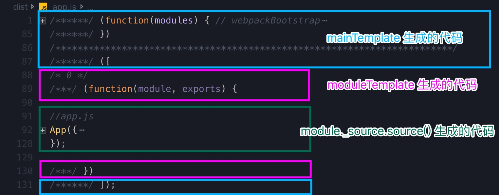

由 mainTemplate 生成的 webpackBootstrap 代码就是 webpack runtime 的代码，是整个应用的执行起点。moduleTemplate 则把我们的代码包裹在一个模块包装器函数中。

代码行有 `/******/` 前缀的表示该行代码由 mainTemplate 生成，有 `/***/` 前缀的表示该行代码由 moduleTemplate 生成，没有前缀的就是我们编写的经过 loader 处理后的模块代码。

我们再来看看 dist/logs/logs.js 的代码


可以看到

- 同样生成了 webpack runtime 代码，

- utils/util.js 中的代码被合并到了 dist/logs/logs.js

- logs.js 和 util.js 中的代码分别被包裹在模块包装器中

哪些数字是什么意思呢？它们表示模块的 id。

从上面的代码可以看到，logs.js 通过 `__webpack_require__(3)` 导入了 id 为 3 的模块，这正是 util.js。

我们不希望每个入口文件都生成 runtime 代码，而是希望将其抽离到一个单独的文件中，以减少 app 的体积。我们通过[配置 runtimeChunk](https://webpack.docschina.org/configuration/optimization/#optimization-runtimechunk) 来达到这一目的。

修改 webpack.config.js 文件，添加如下配置

```diff
module.exports = {
+  optimization: {
+    runtimeChunk: {
+      name: 'runtime'
+    }
+  },
  mode: 'none'
}
```

执行 `npx webpack`，

可以看到，在 dist 目录中，生成了名为 runtime.js 的文件

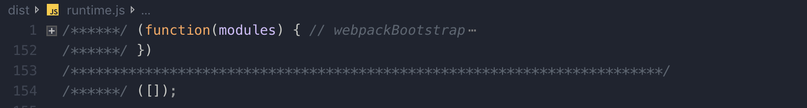

这是一个 [IIFE](https://developer.mozilla.org/zh-CN/docs/Glossary/%E7%AB%8B%E5%8D%B3%E6%89%A7%E8%A1%8C%E5%87%BD%E6%95%B0%E8%A1%A8%E8%BE%BE%E5%BC%8F)。

现在我们开看看 dist/app.js

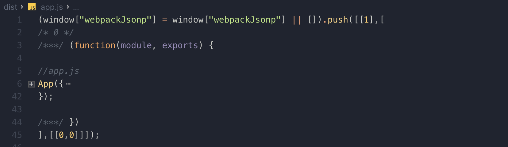

这似乎是要把 app.js 模块存放到全局对象 window 中，但是小程序中并没有 window 对象，只有 wx。我们在 webpack.config.js 中，把全局对象配置为 `wx`

```diff
module.exports = {
  output: {
    path: resolve('dist'),
-   filename: '[name].js'
+   filename: '[name].js',
+   globalObject: 'wx'
  },
}
```

然而，还是有问题，我们的小程序已经跑不起来了

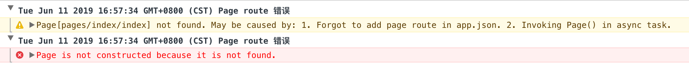

这是因为小程序和 web 应用不一样，web 应用可以通过 `<script>` 标签引用 runtime.js，然而小程序却不能这样。

我们必须让其它模块感知到 runtime.js 的存在，因为 runtime.js 里面是个立即调用函数表达式，所以只要导入 runtime.js 即可。

我们在 assets 渲染阶段曾经提到过：

```js
// 对于每一个入口 module, 即通过 compilation.addEntry 添加的模块
if (chunk.hasEntryModule()) {
  // 触发 renderWithEntry 事件，让我们有机会修改生成后的代码
  source = this.hooks.renderWithEntry.call(source, chunk, hash)
}
```

### 第二个 webpack 插件

之前的 MinaWebpackPlugin 是用来处理 entry 的，这里我们遵循单一职责原则，编写另一个插件来处理 runtime。

幸运的是，已经有人写好这样一个插件了，我们可以直接拿来用 [MinaRuntimePlugin](https://github.com/tinajs/mina-webpack/blob/master/packages/mina-runtime-webpack-plugin/index.js)。

为了方便讲解和学习，我们将其中的代码略作删改，复制到 plugin/MinaRuntimePlugin.js 中

```js
// plugin/MinaRuntimePlugin.js
/*
 * copied from https://github.com/tinajs/mina-webpack/blob/master/packages/mina-runtime-webpack-plugin/index.js
 */
const path = require('path')
const ensurePosix = require('ensure-posix-path')
const { ConcatSource } = require('webpack-sources')
const requiredPath = require('required-path')

function isRuntimeExtracted(compilation) {
  return compilation.chunks.some(chunk => chunk.isOnlyInitial() && chunk.hasRuntime() && !chunk.hasEntryModule())
}

function script({ dependencies }) {
  return ';' + dependencies.map(file => `require('${requiredPath(file)}');`).join('')
}

module.exports = class MinaRuntimeWebpackPlugin {
  constructor(options = {}) {
    this.runtime = options.runtime || ''
  }

  apply(compiler) {
    compiler.hooks.compilation.tap('MinaRuntimePlugin', compilation => {
      for (let template of [compilation.mainTemplate, compilation.chunkTemplate]) {
        // 监听 template 的 renderWithEntry 事件
        template.hooks.renderWithEntry.tap('MinaRuntimePlugin', (source, entry) => {
          if (!isRuntimeExtracted(compilation)) {
            throw new Error(
              [
                'Please reuse the runtime chunk to avoid duplicate loading of javascript files.',
                "Simple solution: set `optimization.runtimeChunk` to `{ name: 'runtime.js' }` .",
                'Detail of `optimization.runtimeChunk`: https://webpack.js.org/configuration/optimization/#optimization-runtimechunk .',
              ].join('\n'),
            )
          }

          // 如果不是入口 chunk，即不是通过 compilation.addEntry 添加的模块所生成的 chunk，就不要管它
          if (!entry.hasEntryModule()) {
            return source
          }

          let dependencies = []
          // 找到该入口 chunk 依赖的其它所有 chunk
          entry.groupsIterable.forEach(group => {
            group.chunks.forEach(chunk => {
              /**
               * assume output.filename is chunk.name here
               */
              let filename = ensurePosix(path.relative(path.dirname(entry.name), chunk.name))

              if (chunk === entry || ~dependencies.indexOf(filename)) {
                return
              }
              dependencies.push(filename)
            })
          })

          // 在源码前面拼接 runtime 以及公共代码依赖
          source = new ConcatSource(script({ dependencies }), source)
          return source
        })
      }
    })
  }
}
```

修改 webpack.config.js，应用该插件

```diff
  const MinaWebpackPlugin = require('./plugin/MinaWebpackPlugin');
+ const MinaRuntimePlugin = require('./plugin/MinaRuntimePlugin');
  module.exports = {
    plugins: [
      new MinaWebpackPlugin(),
+     new MinaRuntimePlugin()
    ],
  }
```

执行 `npx webpack`，我们的小程序此时应该能正常跑起来了。

查看 dist/app.js, dist/pages/index/index.js 等文件，它们的首行都添加了类似 `;require('./../../runtime');` 的代码。

### watch 模式

到目前为止，我们每修改一次代码，便执行一次 `npx webpack`，这有些麻烦，能不能让 webpack 检测文件的变化，自动刷新呢？答案是有的。

webpack 可以以 run 或 watchRun 的方式运行

```js
// https://github.com/webpack/webpack/blob/master/lib/webpack.js#L62
const webpack = (options, callback) => {
  if (options.watch === true || (Array.isArray(options) && options.some(o => o.watch))) {
    const watchOptions = Array.isArray(options) ? options.map(o => o.watchOptions || {}) : options.watchOptions || {}
    // 如果执行了 watch 就不会执行 run
    return compiler.watch(watchOptions, callback)
  }
  compiler.run(callback)
  return compiler
}
```

修改 plugin/MinaWebpackPlugin.js 文件

```js
class MinaWebpackPlugin {
  constructor() {
    this.entries = []
  }

  applyEntry(compiler, done) {
    const { context } = compiler.options
    this.entries
      .map(item => replaceExt(item, '.js'))
      .map(item => path.relative(context, item))
      .forEach(item => itemToPlugin(context, './' + item, replaceExt(item, '')).apply(compiler))
    if (done) {
      done()
    }
  }

  apply(compiler) {
    const { context, entry } = compiler.options
    inflateEntries(this.entries, context, entry)

    compiler.hooks.entryOption.tap('MinaWebpackPlugin', () => {
      this.applyEntry(compiler)
      return true
    })

    // 监听 watchRun 事件
    compiler.hooks.watchRun.tap('MinaWebpackPlugin', (compiler, done) => {
      this.applyEntry(compiler, done)
    })
  }
}
```

执行 `npx webpack --watch --progress` 即可开启 watch 模式，修改源代码并保存，将会重新生成 dist。

## webpack 配置优化

webpack 可以帮助我们 ES6 转 ES5，压缩和混淆代码，因此这些事情，不需要微信开发者工具帮我们做了。点击微信开发者工具右上角的**详情**按钮，在项目设置中，反勾选 ES6 转 ES5，上传代码时自动压缩混淆等选项，如图所示：

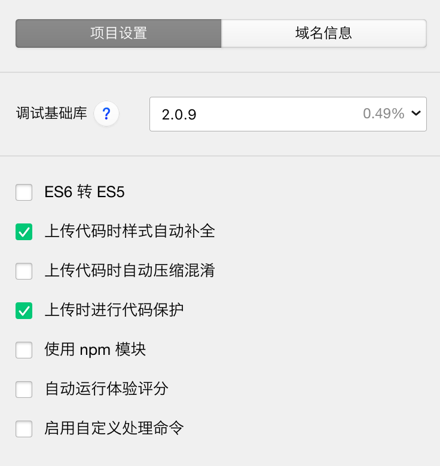

### 抽取公共代码

修改 src/pages/index/index.js 文件，

```diff
+ const util = require('../../utils/util.js');
+ console.log(util.formatTime(new Date()));

  const app = getApp();
```

执行 `npx webpack`

可以看到，生成的 dist/pages/index/index.js 和 dist/pages/logs/logs.js 文件都有同样的代码

```js
;(function(module, exports) {
  // util.js
  var formatTime = function formatTime(date) {
    var year = date.getFullYear()
    var month = date.getMonth() + 1
    var day = date.getDate()
    var hour = date.getHours()
    var minute = date.getMinutes()
    var second = date.getSeconds()
    return [year, month, day].map(formatNumber).join('/') + ' ' + [hour, minute, second].map(formatNumber).join(':')
  }

  var formatNumber = function formatNumber(n) {
    n = n.toString()
    return n[1] ? n : '0' + n
  }

  module.exports = {
    formatTime: formatTime,
  }
})
```

这不是我们希望看到的，我们需要把这些公共代码分离到一个独立的文件当中，相关文档看[这里](https://webpack.docschina.org/guides/code-splitting/#%E9%98%B2%E6%AD%A2%E9%87%8D%E5%A4%8D-prevent-duplication-)。

修改 webpack.config.js 文件

```diff
  optimization: {
+   splitChunks: {
+     chunks: 'all',
+     name: 'common',
+     minChunks: 2,
+     minSize: 0,
+   },
    runtimeChunk: {
      name: 'runtime',
    },
  },
```

执行 `npx webpack`

可以看到 dist 目录下生成了一个 common.js 文件，里面有 util.js 的代码，而 dist/pages/index/index.js 和 dist/pages/logs/logs.js 的首行代码则导入了 common 文件：`;require('./../../runtime');require('./../../common');`

### Tree Shaking

目前，我们通过 `npx webpack` 生成的代码都是未经过压缩和优化的，稍不注意，就会超过微信 2M 大小的限制。

我们可以在生成 dist 代码时，移除哪些我们从来没有使用过的方法，这种方式叫做 [tree shaking](https://webpack.docschina.org/guides/tree-shaking/)。就是把树上的枯枝败叶给摇下来，比喻移除无用的代码。

请根据文档指引进行配置，这里不作展开。

下面我们执行 `npx webpack --mode=production`

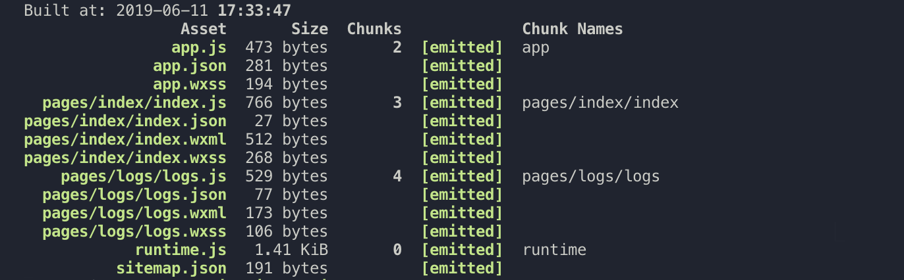

可以看到生成的 app.js 文件大小还不到 1KB

下面，我们引入个大文件

修改 src/app.js 文件，重新引入 lodash

```diff
// app.js
+ import { camelCase } from 'lodash';
App({
  onLaunch: function () {
+    console.log('-----------------------------------------------x');
+    console.log(camelCase('OnLaunch'));
  }
})
```

执行 `npx webpack --mode=production`，可以看到 app.js 文件有将近 70 KB 那么大，为了使用 lodash，这代价也太大了。不过幸好有[优化方法](https://zhuanlan.zhihu.com/p/36280323)：

首先安装以下两个依赖

```
npm i --save-dev babel-plugin-lodash lodash-webpack-plugin
```

修改 webpack.config.js 文件

```diff
  const MinaRuntimePlugin = require('./plugin/MinaRuntimePlugin');
+ const LodashWebpackPlugin = require('lodash-webpack-plugin');

  new MinaRuntimePlugin(),
+ new LodashWebpackPlugin()
```

修改 .babelrc 文件

```diff
{
  "presets": ["@babel/env"],
+ "plugins": ["lodash"]
}
```

再次执行 `npx webpack --mode=production`，可以看到 app.js 只有 4K 不到的大小了，因此我们可以愉快地使用 lodash 了。

至于 moment, 优化后还是有将近 70K，对于小程序来说，这可能难以接受。Github 上有一个项目，叫做 [You Dont Need Moment](https://github.com/you-dont-need/You-Dont-Need-Momentjs)。

### 多环境配置

这里的环境是指小程序的服务器地址，我们的小程序，在开发时，在测试时，在发布时，所需要访问的服务器地址是不一样的。我们通常区分开发环境、测试环境、预发布环境、生产环境等。

现在我们来谈谈 mode，它通常被认为和多环境配置有关。

> 我们在 **tree shaking** 一节中已经对 mode 有所认识。

mode 有三个可能的值，分别是 production, development, none，小程序不能用 development，所以只有 production 和 none 这两个值。

我们看到 production 和 development 这样的单词时，很容易将它们和生产环境、开发环境关联起来，这很容易造成误解。

我们除了需要区分环境，实际上还需要区分构建类型(release, debug)。

我们应该把 mode 看作是构建类型的配置，而不是环境配置。

构建类型和环境可以相互组合，譬如开发环境的 debug 包，生产环境的 debug 包，生产环境的 release 包等等。

所以最佳实践应该是，使用 mode 来决定要不要打经过压缩和优化的包，使用 [EnvironmentPlugin](https://webpack.docschina.org/plugins/environment-plugin) 来配置多环境。

修改 webpack.config.js 文件

```diff
+ const webpack = require('webpack');
+ const debuggable = process.env.BUILD_TYPE !== 'release'
module.exports = {
  plugins: [
+     new webpack.EnvironmentPlugin({
+       NODE_ENV: JSON.stringify(process.env.NODE_ENV) || 'development',
+       BUILD_TYPE: JSON.stringify(process.env.BUILD_TYPE) || 'debug',
+     }),
  ],
-   mode: 'none',
+   mode: debuggable ? 'none' : 'production',
}
```

默认情况下，webpack 会帮我们把 `process.env.NODE_ENV` 的值设置成 mode 的值

使用 NODE_ENV 来区分环境类型是约定俗成的，看[这里](https://dzone.com/articles/what-you-should-know-about-node-env)

我们在代码中，可以通过以下方式读取这些环境变量

```js
console.log(`环境：${process.env.NODE_ENV} 构建类型：${process.env.BUILD_TYPE}`)
```

### npm scripts

我们如何注入 `NODE_ENV` 这些变量的值呢？我们借助 npm scripts 来实现。webpack 官方文档也有关于 npm scripts 的介绍，建议[读一读](https://webpack.docschina.org/guides/getting-started/#npm-scripts)。

首先安装

```
npm i --save-dev cross-env
```

修改 package.json 文件，添加 scripts

```json
{
  "scripts": {
    "start": "webpack --watch --progress",
    "build": "cross-env NODE_ENV=production BUILD_TYPE=release webpack"
  }
}
```

现在，可以使用 `npm run build` 命令，来替代我们之前使用的 `npx webpack --mode=production` 命令。

使用 `npm start` 来替代我们之前使用的 `npx webpack --watch --progress` 命令。

### source mapping

开发时，为了方便调试，上线时，为了能定位到是哪行代码出了问题，我们都需要用到 [source mapping](https://webpack.docschina.org/guides/production/#source-mapping-%E6%BA%90%E7%A0%81%E6%98%A0%E5%B0%84-)。

微信小程序官方是这么描述 source map 的，[点击这里查看](https://developers.weixin.qq.com/miniprogram/dev/devtools/debug.html#%E8%87%AA%E5%8A%A8%E9%A2%84%E8%A7%88)。

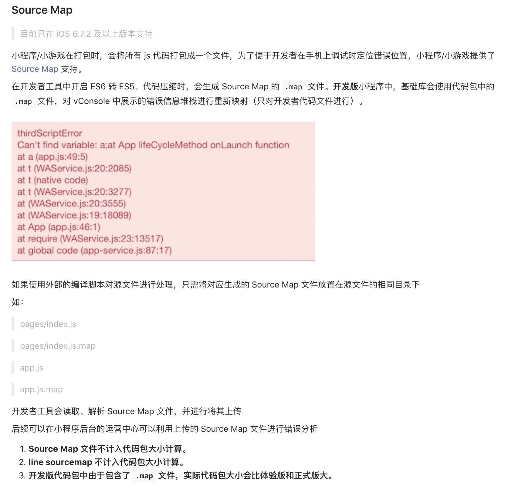

修改 webpack.config.js 文件

```diff
  mode: debuggable ? 'none' : 'production',
+ devtool: debuggable ? 'inline-source-map' : 'source-map',
```

## 支持 Sass

[sass](http://www.ruanyifeng.com/blog/2012/06/sass.html) 是一种 css 预处理器，当然也可以使用其它 css 预处理器，这里仅以 sass 为例，读者很容易举一反三。

安装相关依赖

```
npm i --save-dev sass-loader node-sass file-loader
```

修改 webpack.config.js 文件

```diff
module.exports = {
  module: {
    rules: [
+       {
+         test: /\.(scss)$/,
+         include: /src/,
+         use: [
+           {
+             loader: 'file-loader',
+             options: {
+               useRelativePath: true,
+               name: '[path][name].wxss',
+               context: resolve('src'),
+             },
+           },
+           {
+             loader: 'sass-loader',
+             options: {
+               includePaths: [resolve('src', 'styles'), resolve('src')],
+             },
+           },
+         ],
+       },
    ],
  },
  plugins: [
    new CopyWebpackPlugin([
      {
        from: '**/*',
        to: './',
-       ignore: ['**/*.js', ],
+       ignore: ['**/*.js', '**/*.scss'],
      },
    ]),
    new MinaWebpackPlugin({
+      scriptExtensions: ['.js'],
+      assetExtensions: ['.scss'],
    }),
  ],
}
```

在上面的配置中，我们使用到了 [file-loader](https://webpack.docschina.org/loaders/file-loader), 这是一个可以直接输出文件到 dist 的 loader。

我们在分析 webpack 工作流程时，曾经提到过，loader 主要工作在 module 构建阶段。也就是说，我们依然需要添加 .scss 文件作为 entry，让 loader 能有机会去解析它，并输出最终结果。

每一个 entry 都会对应一个 chunk, 每一个 entry chunk 都会输出一个文件。因为 file-loader 已经帮助我们输出最终我们想要的结果了，所以我们需要阻止这一行为。

修改 plugin/MinaWebpackPlugin.js 文件，以下是修改后的样子

```js
// plugin/MinaWebpackPlugin.js
const SingleEntryPlugin = require('webpack/lib/SingleEntryPlugin')
const MultiEntryPlugin = require('webpack/lib/MultiEntryPlugin')
const path = require('path')
const fs = require('fs')
const replaceExt = require('replace-ext')

const assetsChunkName = '__assets_chunk_name__'

function itemToPlugin(context, item, name) {
  if (Array.isArray(item)) {
    return new MultiEntryPlugin(context, item, name)
  }
  return new SingleEntryPlugin(context, item, name)
}

function _inflateEntries(entries = [], dirname, entry) {
  const configFile = replaceExt(entry, '.json')
  const content = fs.readFileSync(configFile, 'utf8')
  const config = JSON.parse(content)

  ;['pages', 'usingComponents'].forEach(key => {
    const items = config[key]
    if (typeof items === 'object') {
      Object.values(items).forEach(item => inflateEntries(entries, dirname, item))
    }
  })
}

function inflateEntries(entries, dirname, entry) {
  entry = path.resolve(dirname, entry)
  if (entry != null && !entries.includes(entry)) {
    entries.push(entry)
    _inflateEntries(entries, path.dirname(entry), entry)
  }
}

function first(entry, extensions) {
  for (const ext of extensions) {
    const file = replaceExt(entry, ext)
    if (fs.existsSync(file)) {
      return file
    }
  }
  return null
}

function all(entry, extensions) {
  const items = []
  for (const ext of extensions) {
    const file = replaceExt(entry, ext)
    if (fs.existsSync(file)) {
      items.push(file)
    }
  }
  return items
}

class MinaWebpackPlugin {
  constructor(options = {}) {
    this.scriptExtensions = options.scriptExtensions || ['.ts', '.js']
    this.assetExtensions = options.assetExtensions || []
    this.entries = []
  }

  applyEntry(compiler, done) {
    const { context } = compiler.options

    this.entries
      .map(item => first(item, this.scriptExtensions))
      .map(item => path.relative(context, item))
      .forEach(item => itemToPlugin(context, './' + item, replaceExt(item, '')).apply(compiler))

    // 把所有的非 js 文件都合到同一个 entry 中，交给 MultiEntryPlugin 去处理
    const assets = this.entries
      .reduce((items, item) => [...items, ...all(item, this.assetExtensions)], [])
      .map(item => './' + path.relative(context, item))
    itemToPlugin(context, assets, assetsChunkName).apply(compiler)

    if (done) {
      done()
    }
  }

  apply(compiler) {
    const { context, entry } = compiler.options
    inflateEntries(this.entries, context, entry)

    compiler.hooks.entryOption.tap('MinaWebpackPlugin', () => {
      this.applyEntry(compiler)
      return true
    })

    compiler.hooks.watchRun.tap('MinaWebpackPlugin', (compiler, done) => {
      this.applyEntry(compiler, done)
    })

    compiler.hooks.compilation.tap('MinaWebpackPlugin', compilation => {
      // beforeChunkAssets 事件在 compilation.createChunkAssets 方法之前被触发
      compilation.hooks.beforeChunkAssets.tap('MinaWebpackPlugin', () => {
        const assetsChunkIndex = compilation.chunks.findIndex(({ name }) => name === assetsChunkName)
        if (assetsChunkIndex > -1) {
          // 移除该 chunk, 使之不会生成对应的 asset，也就不会输出文件
          // 如果没有这一步，最后会生成一个 __assets_chunk_name__.js 文件
          compilation.chunks.splice(assetsChunkIndex, 1)
        }
      })
    })
  }
}

module.exports = MinaWebpackPlugin
```

## 感谢以下项目以及文章

[细说 webpack 之流程篇](http://taobaofed.org/blog/2016/09/09/webpack-flow/)

[mina-webpack](https://github.com/tinajs/mina-webpack)

[wxapp-webpack-plugin](https://github.com/Cap32/wxapp-webpack-plugin)
